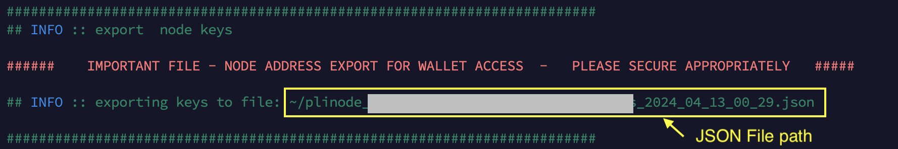

# decryptFromJson
[Japanese](./README_jp.md)<br>
In Plugin Node, Node Address is saved as a JSON file.<br>
In order to know PrivateKey, I needed to import a JSON file into XDCPay.<br>
This feature allows you to retrieve the PrivateKey from a JSON file on your VPS.

# Procedure
## 1. Copy repository
```
git clone https://github.com/AoiToSouma/decryptFromJson.git
cd decryptFromJson
```

## 2. Installing npm packages
```
npm install
```

## 3. Execution
The following information is required to obtain a PrivateKey.<br>
JSON file with address information defined<br>
Keystore (password)<br>
For plugin V2, it can be obtained using the following command.

### JSON File
```
cd ~/pluginV2Install
./pli_node_scripts.sh keys
```


A JSON file is created in your home directory.<br>
Copy this path.

### Keystore
```
cat ~/pluginV2/secrets.toml | grep "^s*Keystore"
```
Copy the strings separated by quotation(').

### Execution
```
node decryptFromJson.js
```
For ```Enter full path of wallet json file:```, enter full path of the JSON file.<br>
For ```Enter Keystore: ```, enter the Keystore value.<br>
If the combination is correct, ```Press any key to display: ``` will be displayed.<br>
Any input, including the Enter key, will display Address information.<br>
Immediately after checking, clear the screen using the command below.
```
clear
```
The above information is not stored anywhere on the VPS. It will only be displayed.
